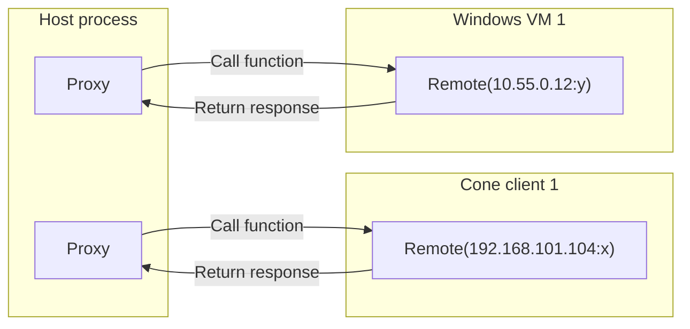

# NAT lab

NAT lab is an environment where libtelio is tested.
We are working on making it locally runnable for everyone outside of
Nord Security organization, but currently it is only possible to run
them in the CI.

## Prerequisites

- [just](https://just.systems/)
- [uv](https://docs.astral.sh/uv/)

## Formatting

Python code is formatted using https://github.com/psf/black, https://github.com/PyCQA/isort and https://github.com/PyCQA/autoflake.
Unformatted code will automatically be declined by the CI.
```
just black && just isort && just autoflake
```

## Linter and typecheck

Python code is checked using https://github.com/python/mypy and https://github.com/pylint-dev/pylint.
Any faulty code will automatically be declined by the CI.
```
just mypy && just pylint
```

## Dependency lock / upgrade
All dependencies and transitive dependencies should be locked to prevent breaking things. Also has to be updated from time to time, to keep things fresh.

#### How to lock
```
$ uv lock
```

#### How to upgrade

Edit the `pyproject.toml` and after that run `uv sync`. See [here](https://docs.astral.sh/uv/concepts/projects/dependencies/) for detailed description of dependency management with uv.

## Network topology
For the network topology of the containers please refer to [network.md](network.md)

The diagram is generated by parsing the `docker-compose.yml` file.
To update the diagram run 
```bash
python3 utils/generate_network_diagram.py docker-compose.yml network.md
```

## Architecture

### RPC

When a natlab test is run, the actual test is run on the machine/VM/container that is acting as the test host, but it needs to interact with instances of libtelio on other containers/VMs. Otherwise, we wouldn't be able to enable VPN, check events, etc which are essential to having tests we can trust. In the past, we would start `tcli` on the relevant container/VM and then interact with it over stdout/stdin. Since libtelio v5 we are generating our FFI bindings with UniFFI, and with that we decided that it would be good to use the generated bindings in natlab as well to dogfood not just the libtelio functionality, but also the bindings themselves. Since natlab is written in python the natural choice was to have UniFFI generate python bindings and use those in natlab, but that meant that we need to change how we interact with the remote libtelio instances. We chose Pyro5 for those interactions.

In a nutshell, Pyro5 is a remote object library for python that allows two different python scripts that may or may not be running on different machines to interact as if they were part of the same script. Pyro5 connections have a `proxy` and a `remote`, where the `remote` has some functionality that the `proxy` needs to interact with. `proxy` and `remote` are disctinct roles in a connection and as such, for a single connection only one side can be `proxy` and only one side can be `remote`. That said, it is entirely possible to have multiple connections between two scripts, allowing either side of the connection to act as both `proxy` and `remote` at the same time. In natlab we are not using that kind of bidirectional connection so for us the separation of concern is clear: the test host is the `proxy` and the container/VM in which libtelio is running is the `remote`.

On the container/VM where libtelio is to be run, we execute `libtelio_remote.py` which dynamically loads the libtelio library (`libtelio.so` on linux, `libtelio.dylib` on macos and `telio.dll` on windows). It then starts a Pyro5 server, letting Pyro5 select an available port. That port is then written to stdout. The `remote` is started by a natlab test `Client` (from `telio.py`), which can pick up the port number by reading the port number from stdout, and creating a `LibtelioProxy` object (from `libtelio_proxy.py`) and pointing it at the IP of the relevant container/VM and the port it just picked up. This kind of port/service discovery is done to avoid port collisions, which was fairly common before when the ports were decided by the test host.



Pyro5 can't send arbitrary objects back and forth, only objects explicitly exposed over the Pyro5 layer. To still allow sending strongly typed classes between `proxy` and `remote`, there is a serialization implementation that will transparently convert to and from python dictionaries. In `serialization.py` there is a function `init_serialization` that will configure Pyro5 in the current python interpreter to be able to serialize and deserialize pretty much any object. Serializing is one by creating a dict that contains the class name and the data the object holds as a dict, and deserialization is the same but opposite. This way, we can send any objects back and forth without ever having to deal with serialization issues.

Libtelio emits boths logs and events during runtime that are potentially relevant for our natlab tests, so we need to be able to pick them up. On the `remote` where the libtelio instance is actually being run, it's as simple as implementing the `TelioLoggerCb` and `TelioEventCb` and using those to get the events out of libtelio. The logs that are picked up through the callback are directly written to file whereas the events are stored in a list. Each `Client` object (from `telio.py`, which keeps a `proxy` object) then continuously polls for events. The `proxy` can only fetch one event at a time, but when the polling is happening, the `proxy` will get all available events one by one, then wait one second, and then poll again. This way, we get all available events without having to wait more, but we're not burning resources by constantly polling. The 1s timeout could be reduced if necessary.
