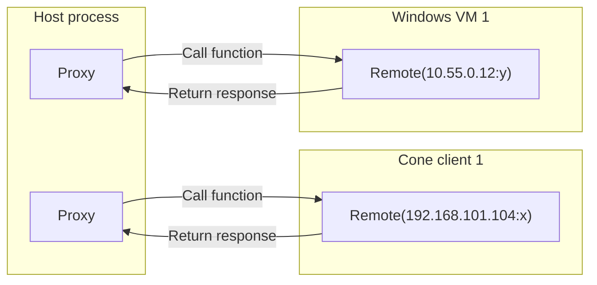

# Nat-Lab

Nat-Lab provides a reproducible, containerized environment for testing libtelio end-to-end across different networking scenarios (NATs, DERP, UPNP, etc.), plus a runner to build libtelio and execute the pytest-based suite locally.

- Orchestration scripts: [natlab.py](natlab.py) (environment lifecycle), [run_local.py](run_local.py) (build and test runner)
- Tests: [tests/](tests)
- Topology: [docker-compose.yml](docker-compose.yml), doc: [network.md](network.md)
- Coding standards and tools: [pyproject.toml](pyproject.toml), authoring guidance: [guidelines.md](guidelines.md)

Note: CI is the canonical execution environment. Local runs are supported where possible and are helpful for day-to-day development.

Contents
- Quickstart
- Requirements
- Environment lifecycle (start/stop/restart/check)
- Running tests locally
- Selecting tests with markers
- Formatting, linting, and type checking
- Dependency management
- Network topology diagram
- Architecture
- Troubleshooting
- Repository layout tips

Quickstart
1) Install prerequisites
- Docker (Compose v2). If Docker Server < 28.0, Nat-Lab auto-fallback to a compatible bridge mode (see Troubleshooting).
- Python as per [.python-version](.python-version). Current pin: cpython-3.11 (3.10+ may work; 3.11 is recommended).
- uv (https://docs.astral.sh/uv/)
- just (optional)

2) Sync Python dependencies
From [nat-lab dir](libtelio/nat-lab):
```
uv sync
```

3) Start the Nat-Lab infrastructure
From [nat-lab dir](libtelio/nat-lab):
```
python3 natlab.py --start
# or via uv to isolate env:
uv run python3 natlab.py --start
```
This builds and brings up the Docker-compose environment and generates gRPC stubs for ENS. See [python.start()](natlab.py) and [python.generate_grpc()](natlab.py).

4) Build libtelio and run tests
From [nat-lab dir](libtelio/nat-lab):
```
uv run python3 run_local.py
```
This will:
- Optionally verify setup correctness (see [python.verify_setup_correctness()](run_local.py))
- Build the required libtelio binaries (see [python.run_build_command()](run_local.py))
- Run type checks (mypy)
- Run pytest with default selection and timeouts (see [python.main()](run_local.py) and [python.get_pytest_arguments()](run_local.py))

Requirements
- OS: Linux host recommended for full container suite; macOS partially supported (see options below). Windows testing leverages a Windows VM.
- Docker: Ensure a recent Docker Engine/Compose installation. If Docker Server version < 28.0, Nat-Lab will patch the compose to a compatible bridge mode, see [python.check_docker_version_compatibility()](natlab.py).
- Resources: Builds can be memory heavy. At least 16 GB RAM recommended (see warning in [python.main()](run_local.py)).
- Python: 3.10+ with [uv](https://docs.astral.sh/uv/) for dependency management.

Environment lifecycle
The environment lifecycle is managed by [natlab.py](natlab.py).

- Start
```
uv run python3 natlab.py --start
```
- Stop
```
uv run python3 natlab.py --stop
```
- Kill (SIGKILL containers) and Stop
```
uv run python3 natlab.py --kill
```
- Restart (kill then start)
```
uv run python3 natlab.py --restart
```
- Check that all containers are running
```
uv run python3 natlab.py --check-containers
```
If a service is missing, the script prints compose logs for that service and fails. See [python.check_containers()](natlab.py).

Running tests locally
Use [run_local.py](run_local.py) to build and run the test-suite. Common flags:
- -k "expr"            Pytest -k expression
- -m "markexpr"        Pytest mark expression
- -x                   Stop on first failure
- -v                   Show live stdout from tests
- --reruns N           Rerun failures N times
- --count N            Repeat tests N times
- --windows            Include “windows” mark
- --mac                Include “mac” mark
- --linux-native       Include “linux_native” mark
- --moose              Build with moose features
- --nobuild            Skip building libtelio
- --notests            Skip running tests
- --notypecheck        Skip mypy
- --telio-debug        Use debug binaries (sets TELIO_BIN_PROFILE=debug)

Examples
- Run default selection (excludes nat, windows, mac, linux_native, long, moose):
```
uv run python3 run_local.py
```
- Run a single test by name:
```
uv run python3 run_local.py -k test_direct_connection
```
- Run utils-only tests:
```
uv run python3 run_local.py -m utils
```
- Run Windows-marked tests (requires Windows VM available to runners):
```
uv run python3 run_local.py --windows
```
- Run with debug libtelio and verbose output:
```
uv run python3 run_local.py --telio-debug -v
```

Selecting tests with markers
Markers are defined in [pyproject.toml](pyproject.toml). Useful ones:
- nat           test only passes once before env restart
- windows       requires Windows VM
- mac           requires macOS VM
- linux_native  tests using native WireGuard on Linux
- long          long-running tests
- moose         requires build with “moose”
- ipv4 / ipv6 / ipv4v6
- batching
- utils

To include a marker:
```
uv run python3 run_local.py -m "utils"
```
By default, [python.get_pytest_arguments()](run_local.py) excludes nat, windows, mac, linux_native, long, moose unless you opt-in via flags.

Formatting, linting, type checking
- Using just:
```
just black && just isort && just autoflake
just mypy && just pylint
```
- Without just (equivalents):
```
uv run black .
uv run isort .
uv run autoflake -r -i .
uv run mypy .
uv run pylint .
```
Configuration lives in [pyproject.toml](pyproject.toml) for black, isort, autoflake, mypy, pylint, and pytest.

Dependency management
All dependencies are locked. See [pyproject.toml](pyproject.toml).

- Install/Sync:
```
uv sync
```
- Lock (refresh lockfile):
```
uv lock
```
- Upgrade a dependency:
  - Edit [pyproject.toml](pyproject.toml)
  - Then:
```
uv sync
```
See uv docs for advanced flows.

Network topology diagram
See [network.md](network.md) for an up-to-date topology description, generated from [docker-compose.yml](docker-compose.yml).
Regenerate the diagram after changes:
```
python3 utils/generate_network_diagram.py docker-compose.yml network.md
```

Architecture
When a natlab test is run, the actual test is run on the machine/VM/container that is acting as the test host, but it needs to interact with instances of libtelio on other containers/VMs. Otherwise, we wouldn't be able to enable VPN, check events, etc which are essential to having tests we can trust. In the past, we would start `tcli` on the relevant container/VM and then interact with it over stdout/stdin. Since libtelio v5 we are generating our FFI bindings with UniFFI, and with that we decided that it would be good to use the generated bindings in natlab as well to dogfood not just the libtelio functionality, but also the bindings themselves. Since natlab is written in python the natural choice was to have UniFFI generate python bindings and use those in natlab, but that meant that we need to change how we interact with the remote libtelio instances. We chose Pyro5 for those interactions.

In a nutshell, Pyro5 is a remote object library for python that allows two different python scripts that may or may not be running on different machines to interact as if they were part of the same script. Pyro5 connections have a `proxy` and a `remote`, where the `remote` has some functionality that the `proxy` needs to interact with. `proxy` and `remote` are disctinct roles in a connection and as such, for a single connection only one side can be `proxy` and only one side can be `remote`. That said, it is entirely possible to have multiple connections between two scripts, allowing either side of the connection to act as both `proxy` and `remote` at the same time. In natlab we are not using that kind of bidirectional connection so for us the separation of concern is clear: the test host is the `proxy` and the container/VM in which libtelio is running is the `remote`.

On the container/VM where libtelio is to be run, we execute `libtelio_remote.py` which dynamically loads the libtelio library (`libtelio.so` on linux, `libtelio.dylib` on macos and `telio.dll` on windows). It then starts a Pyro5 server, letting Pyro5 select an available port. That port is then written to stdout. The `remote` is started by a natlab test `Client` (from `telio.py`), which can pick up the port number by reading the port number from stdout, and creating a `LibtelioProxy` object (from `libtelio_proxy.py`) and pointing it at the IP of the relevant container/VM and the port it just picked up. This kind of port/service discovery is done to avoid port collisions, which was fairly common before when the ports were decided by the test host.



Pyro5 can't send arbitrary objects back and forth, only objects explicitly exposed over the Pyro5 layer. To still allow sending strongly typed classes between `proxy` and `remote`, there is a serialization implementation that will transparently convert to and from python dictionaries. In `serialization.py` there is a function `init_serialization` that will configure Pyro5 in the current python interpreter to be able to serialize and deserialize pretty much any object. Serializing is one by creating a dict that contains the class name and the data the object holds as a dict, and deserialization is the same but opposite. This way, we can send any objects back and forth without ever having to deal with serialization issues.

Libtelio emits boths logs and events during runtime that are potentially relevant for our natlab tests, so we need to be able to pick them up. On the `remote` where the libtelio instance is actually being run, it's as simple as implementing the `TelioLoggerCb` and `TelioEventCb` and using those to get the events out of libtelio. The logs that are picked up through the callback are directly written to file whereas the events are stored in a list. Each `Client` object (from `telio.py`, which keeps a `proxy` object) then continuously polls for events. The `proxy` can only fetch one event at a time, but when the polling is happening, the `proxy` will get all available events one by one, then wait one second, and then poll again. This way, we get all available events without having to wait more, but we're not burning resources by constantly polling. The 1s timeout could be reduced if necessary.
Troubleshooting
- Docker version < 28.0 and nat-unprotected
  - Nat-Lab prefers the “nat-unprotected” bridge mode. On Docker Server < 28.0, Nat-Lab will warn and patch compose to use “nat” instead, creating a backup compose file. See [python.check_docker_version_compatibility()](natlab.py).
- Containers failed to start
  - Use:
```
uv run python3 natlab.py --check-containers
docker compose ps
docker compose logs <service>
```
  - The starter already prints logs of missing services; see [python.check_containers()](natlab.py).
- Build killed (SIGKILL) / out of memory
  - Need >= 16 GB RAM or set:
```
export NATLAB_REDUCE_PARALLEL_LINKERS=1
```
  - See warnings in [python.main()](run_local.py).
- Mismatch between project root HEAD and “triggered-ref”
  - You will see a warning if your local checkout differs from the expected tag/commit used by CI; see [python.verify_setup_correctness()](run_local.py). It’s safe to proceed for local iteration, but results might diverge from CI behavior.

Repository layout tips
- Entrypoints
  - [natlab.py](natlab.py): lifecycle for Docker environment (start/stop/restart/check), gRPC generation via [python.generate_grpc()](natlab.py)
  - [run_local.py](run_local.py): local build and test driver
- Tests
  - [tests/](tests): pytest suite and utilities under [tests/utils/](tests/utils)
- Guidelines for writing tests
  - See [guidelines.md](guidelines.md) for best practices (parametrize, explicit assertions, event-based waits, cleanup discipline, use wrappers for external tools, etc.)

CI notes
Nat-Lab runs in CI by default, with its own provisioning. Local runs are for iteration and debugging; ensure parity with CI by keeping your checkout aligned and regenerating artifacts as needed.

Appendix: useful direct commands
- Full rebuild and test with verbose logs:
```
uv run python3 run_local.py -v
```
- Only type-check:
```
uv run mypy .
```
- Only run a subset of tests:
```
uv run python3 run_local.py -k test_pinging -m "ipv4 or ipv6"
```
- Bring env down:
```
uv run python3 natlab.py --stop
```


Logs and artifacts (enabling and locations)
- Enable full log capture:
  - Export before running tests:
    ```
    export NATLAB_SAVE_LOGS=1
    ```
  - This starts session-long tcpdump on core nodes at session start/end via [python.pytest_sessionstart()](tests/conftest.py) and [python.pytest_sessionfinish()](tests/conftest.py), which calls [python.start_tcpdump_processes()](tests/conftest.py) and aggregates artifacts.

- Per-test logs and pcaps:
  - Log directory per test is computed by [python.get_current_test_log_path()](tests/utils/testing.py), resulting in logs/&lt;test_name&gt;[_&lt;params&gt;]
  - Python logger writes debug logs when NATLAB_SAVE_LOGS is set via [python.setup_logger()](tests/conftest.py)
    - File: logs/&lt;test_name&gt;[_&lt;params&gt;]/debug.log
  - Per-connection pcaps are downloaded at the end of tcpdump contexts (per test) by [python.make_tcpdump()](tests/utils/tcpdump.py)
    - Files: logs/&lt;test_name&gt;[_&lt;params&gt;]/&lt;ConnectionTag&gt;.pcap
    - Name uniqueness handled by [python.find_unique_path_for_tcpdump()](tests/utils/tcpdump.py)
  - Session local capture (host):
    - File: logs/local.pcap (created by [python.make_local_tcpdump()](tests/utils/tcpdump.py))

- Kernel and system logs (host and VMs):
  - Before tests (if NATLAB_SAVE_LOGS is set) and after tests, [python.collect_kernel_logs()](tests/conftest.py) collects:
    - Host dmesg: logs/dmesg-before_tests.txt and logs/dmesg-after_tests.txt (from [python.save_dmesg_from_host()](tests/conftest.py))
    - Host audit: logs/audit_before_tests.log and logs/audit_after_tests.log (from [python.save_audit_log_from_host()](tests/conftest.py))
  - Mac diagnostic reports (in CI or when NATLAB_COLLECT_MAC_DIAGNOSTIC_LOGS=1):
    - Directories: logs/system_diagnostic_reports and logs/user_diagnostic_reports (via [python.collect_mac_diagnostic_reports()](tests/conftest.py))

- Service logs:
  - DERP relays: logs/derp_01_relay.log, logs/derp_02_relay.log, logs/derp_03_relay.log via [python.collect_nordderper_logs()](tests/conftest.py)
  - DNS servers: logs/dns_server_1.log, logs/dns_server_2.log via [python.collect_dns_server_logs()](tests/conftest.py)
  - FakeFM (NLX): logs/fakefm.log via [python.save_fakefm_logs()](tests/conftest.py)

- Tcpdump internals (useful when customizing):
  - Binary and host file paths are defined in [python.build_tcpdump_command()](tests/utils/tcpdump.py) and PCAP_FILE_PATH map at [python.PCAP_FILE_PATH](tests/utils/tcpdump.py)
  - Windows tcpdump in-tests is temporarily disabled (see TODO in [python.make_tcpdump()](tests/utils/tcpdump.py))

- Example: run a single test and keep all logs
  ```
  export NATLAB_SAVE_LOGS=1
  uv run python3 run_local.py -k test_direct_connection -v
  ```
  Output artifacts under logs/test_direct_connection*/ with debug.log, per-node pcaps, host local.pcap, and service/system logs.

SSH access to VMs (dockur_* based)
- Credentials come from composition and SshConnection defaults:
  - Windows VMs: user bill / password gates (see [python.SshConnection.new_connection()](tests/utils/connection/ssh_connection.py))
    - IPs: 192.168.150.54 (VM_WINDOWS_1), 192.168.152.54 (VM_WINDOWS_2) from [python.LAN_ADDR_MAP](tests/config.py)
    - Example:
      ```
      ssh bill@192.168.150.54   # password: gates
      ```
  - macOS VM: user root / password jobs (see [python.SshConnection.new_connection()](tests/utils/connection/ssh_connection.py))
    - IP: 192.168.154.54 from [python.LAN_ADDR_MAP](tests/config.py)
    - Example:
      ```
      ssh root@192.168.154.54   # password: jobs
      ```
  - Linux VMs (dockur_linux):
    - NLX VM: root / root at 10.0.100.51 ([python.LAN_ADDR_MAP](tests/config.py))
      ```
      ssh root@10.0.100.51      # password: root
      ```
    - Fullcone gateway VMs: root / root at 10.0.254.9 and 10.0.254.6 (see services fullcone-gw-01/02 in [docker-compose.yml](docker-compose.yml))
      ```
      ssh root@10.0.254.9       # password: root
      ssh root@10.0.254.6       # password: root
      ```
- Notes:
  - On Linux hosts, Docker bridge subnets are reachable from the host (so you can SSH directly to 192.168.x.x and 10.0.x.x addresses).
  - Credentials for dockur_* images are also reflected in service environment in [docker-compose.yml](docker-compose.yml).

Additional runtime toggles and setup checks (from conftest.py)
- Setup checks are performed before running tests via [python.pytest_runtestloop()](tests/conftest.py):
  - Inter-DERP connectivity: [python.setup_check_interderp()](tests/conftest.py), verifies cluster routing and saves logs.
  - Duplicate MAC detection: [python.setup_check_duplicate_mac_addresses()](tests/conftest.py).
  - To skip setup checks:
    ```
    export NATLAB_SKIP_SETUP_CHECKS=1
    ```
- Pre-test cleanup is executed for every test via [python.pytest_runtest_setup()](tests/conftest.py) calling [python.perform_pretest_cleanups()](tests/conftest.py):
  - Process cleanup (sudo) is disabled locally by default; to enable:
    ```
    export ENABLE_NATLAB_PROCESS_CLEANUP=1
    ```
    Invokes [python.kill_natlab_processes()](tests/conftest.py) which runs [bin/cleanup_natlab_processes](bin/cleanup_natlab_processes).
  - Clears ephemeral setup state.
- Automatic copying of libtelio binaries to VMs when tests require them (based on markers):
  - Triggered during collection run-loop via [python._copy_vm_binaries_if_needed()](tests/conftest.py), using [python._copy_vm_binaries()](tests/conftest.py)
  - Windows/Mac tests will push binaries before execution using SSH.
- Enable Mac diagnostic logs collection locally (outside CI):
  ```
  export NATLAB_COLLECT_MAC_DIAGNOSTIC_LOGS=1
  ```

Python version pin
- Python interpreter is defined by [.python-version](.python-version) and currently pinned to cpython-3.11. Use that version for uv and local runs. Example with pyenv:
  ```
  pyenv install -s 3.11.9
  pyenv local 3.11.9
  uv sync
  ```

Pytest HTML report
- Nat-Lab enables pytest-html in [pyproject.toml](pyproject.toml) via addopts. Each run writes a self-contained HTML report to:
  - report.html (in the directory you run pytest from; when using run_local.py from Nat-Lab, the file is: libtelio/nat-lab/report.html)
- Open the report:
  - Linux: xdg-open report.html
  - macOS: open report.html
- Customize the output location or file name:
  - pytest --html=out/report.html --self-contained-html
- Notes:
  - The report includes captured logs, durations, and rerun status (if using --reruns). It’s portable for CI artifacts.
