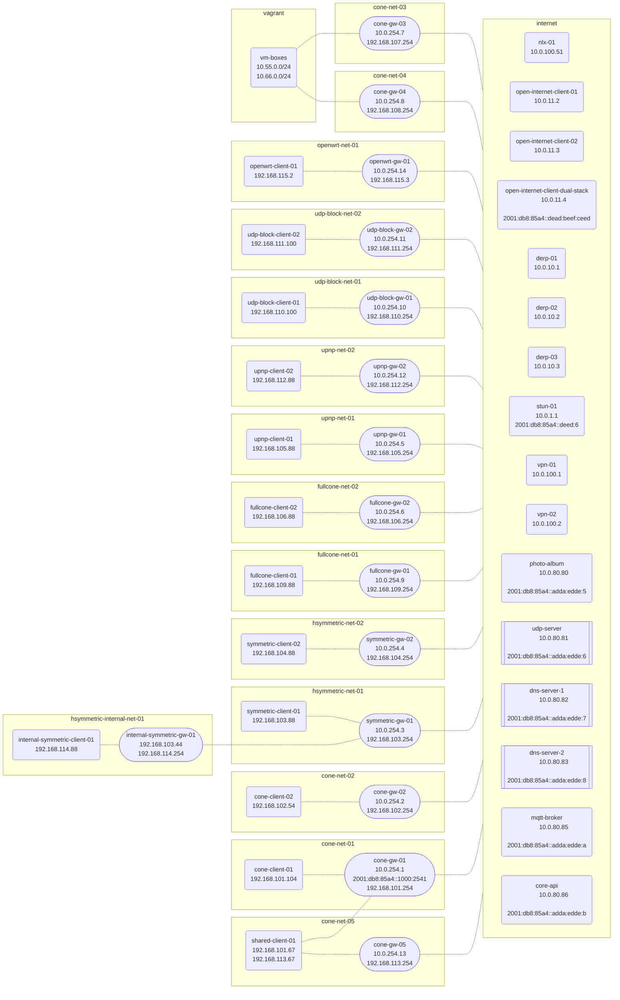

```mermaid
graph LR
%% AUTO GENERATED DIAGRAM. To update run `./utils/generate_network_diagram.py docker-compose.yml network.md`

%% Networks
  %% Network internet
  subgraph internet[internet]
  direction LR
    nlx-01("nlx-01
        10.0.100.51")
    open-internet-client-01("open-internet-client-01
        10.0.11.2")
    open-internet-client-02("open-internet-client-02
        10.0.11.3")
    open-internet-client-dual-stack("open-internet-client-dual-stack
        10.0.11.4
        2001:db8:85a4::dead:beef:ceed")
    derp-01("derp-01
        10.0.10.1")
    derp-02("derp-02
        10.0.10.2")
    derp-03("derp-03
        10.0.10.3")
    stun-01("stun-01
        10.0.1.1
        2001:db8:85a4::deed:6")
    vpn-01("vpn-01
        10.0.100.1")
    vpn-02("vpn-02
        10.0.100.2")
    photo-album("photo-album
        10.0.80.80
        2001:db8:85a4::adda:edde:5")
    udp-server[["udp-server
        10.0.80.81
        2001:db8:85a4::adda:edde:6"]]
    dns-server-1[["dns-server-1
        10.0.80.82
        2001:db8:85a4::adda:edde:7"]]
    dns-server-2[["dns-server-2
        10.0.80.83
        2001:db8:85a4::adda:edde:8"]]
    mqtt-broker("mqtt-broker
        10.0.80.85
        2001:db8:85a4::adda:edde:a")
    core-api("core-api
        10.0.80.86
        2001:db8:85a4::adda:edde:b")
  end

  %% Network cone-net-05
  subgraph cone-net-05[cone-net-05]
  direction LR
    shared-client-01("shared-client-01
        192.168.101.67
        192.168.113.67")
    cone-gw-05(["cone-gw-05
        10.0.254.13
        192.168.113.254"])
  end

  %% Network cone-net-01
  subgraph cone-net-01[cone-net-01]
  direction LR
    cone-client-01("cone-client-01
        192.168.101.104")
    cone-gw-01(["cone-gw-01
        10.0.254.1
        2001:db8:85a4::1000:2541
        192.168.101.254"])
  end

  %% Network cone-net-02
  subgraph cone-net-02[cone-net-02]
  direction LR
    cone-client-02("cone-client-02
        192.168.102.54")
    cone-gw-02(["cone-gw-02
        10.0.254.2
        192.168.102.254"])
  end

  %% Network cone-net-03
  subgraph cone-net-03[cone-net-03]
  direction LR
    cone-gw-03(["cone-gw-03
        10.0.254.7
        192.168.107.254"])
  end

  %% Network cone-net-04
  subgraph cone-net-04[cone-net-04]
  direction LR
    cone-gw-04(["cone-gw-04
        10.0.254.8
        192.168.108.254"])
  end

  %% Network hsymmetric-net-01
  subgraph hsymmetric-net-01[hsymmetric-net-01]
  direction LR
    symmetric-client-01("symmetric-client-01
        192.168.103.88")
    symmetric-gw-01(["symmetric-gw-01
        10.0.254.3
        192.168.103.254"])
  end

  %% Network hsymmetric-net-02
  subgraph hsymmetric-net-02[hsymmetric-net-02]
  direction LR
    symmetric-client-02("symmetric-client-02
        192.168.104.88")
    symmetric-gw-02(["symmetric-gw-02
        10.0.254.4
        192.168.104.254"])
  end

  %% Network hsymmetric-internal-net-01
  subgraph hsymmetric-internal-net-01[hsymmetric-internal-net-01]
  direction LR
    internal-symmetric-client-01("internal-symmetric-client-01
        192.168.114.88")
    internal-symmetric-gw-01(["internal-symmetric-gw-01
        192.168.103.44
        192.168.114.254"])
  end

  %% Network fullcone-net-01
  subgraph fullcone-net-01[fullcone-net-01]
  direction LR
    fullcone-client-01("fullcone-client-01
        192.168.109.88")
    fullcone-gw-01(["fullcone-gw-01
        10.0.254.9
        192.168.109.254"])
  end

  %% Network fullcone-net-02
  subgraph fullcone-net-02[fullcone-net-02]
  direction LR
    fullcone-client-02("fullcone-client-02
        192.168.106.88")
    fullcone-gw-02(["fullcone-gw-02
        10.0.254.6
        192.168.106.254"])
  end

  %% Network upnp-net-01
  subgraph upnp-net-01[upnp-net-01]
  direction LR
    upnp-client-01("upnp-client-01
        192.168.105.88")
    upnp-gw-01(["upnp-gw-01
        10.0.254.5
        192.168.105.254"])
  end

  %% Network upnp-net-02
  subgraph upnp-net-02[upnp-net-02]
  direction LR
    upnp-client-02("upnp-client-02
        192.168.112.88")
    upnp-gw-02(["upnp-gw-02
        10.0.254.12
        192.168.112.254"])
  end

  %% Network udp-block-net-01
  subgraph udp-block-net-01[udp-block-net-01]
  direction LR
    udp-block-client-01("udp-block-client-01
        192.168.110.100")
    udp-block-gw-01(["udp-block-gw-01
        10.0.254.10
        192.168.110.254"])
  end

  %% Network udp-block-net-02
  subgraph udp-block-net-02[udp-block-net-02]
  direction LR
    udp-block-client-02("udp-block-client-02
        192.168.111.100")
    udp-block-gw-02(["udp-block-gw-02
        10.0.254.11
        192.168.111.254"])
  end

  %% Network openwrt-net-01
  subgraph openwrt-net-01[openwrt-net-01]
  direction LR
    openwrt-client-01("openwrt-client-01
        192.168.115.2")
    openwrt-gw-01(["openwrt-gw-01
        10.0.254.14
        192.168.115.3"])
  end

  %% Node Connections
  cone-gw-01 -..- internet
  cone-gw-02 -..- internet
  cone-gw-03 -..- internet
  cone-gw-04 -..- internet
  cone-gw-05 -..- internet
  symmetric-gw-01 -..- internet
  symmetric-gw-02 -..- internet
  fullcone-gw-01 -..- internet
  fullcone-gw-02 -..- internet
  upnp-gw-01 -..- internet
  upnp-gw-02 -..- internet
  udp-block-gw-01 -..- internet
  udp-block-gw-02 -..- internet
  openwrt-gw-01 -..- internet
  cone-client-01 -.- cone-gw-01
  shared-client-01 -.- cone-gw-01
  shared-client-01 -.- cone-gw-05
  cone-client-02 -.- cone-gw-02
  symmetric-client-01 -.- symmetric-gw-01
  internal-symmetric-gw-01 -..- symmetric-gw-01
  symmetric-client-02 -.- symmetric-gw-02
  internal-symmetric-client-01 -.- internal-symmetric-gw-01
  fullcone-client-01 -.- fullcone-gw-01
  fullcone-client-02 -.- fullcone-gw-02
  upnp-client-01 -.- upnp-gw-01
  upnp-client-02 -.- upnp-gw-02
  udp-block-client-01 -.- udp-block-gw-01
  udp-block-client-02 -.- udp-block-gw-02
  openwrt-client-01 -.- openwrt-gw-01

  %% Vagrant boxes
  subgraph vagrant
    vm-boxes("vm-boxes
        10.55.0.0/24 
        10.66.0.0/24")
  end
  vm-boxes -.- cone-gw-03
  vm-boxes -.- cone-gw-04
```
